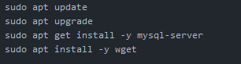
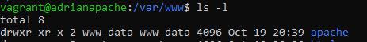
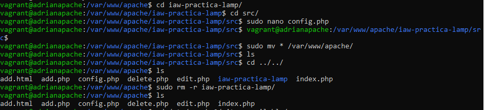
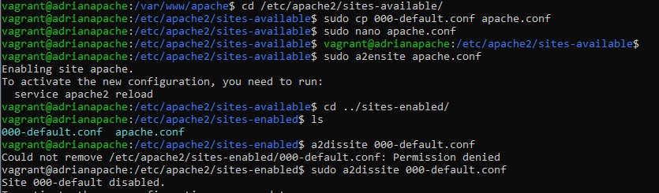
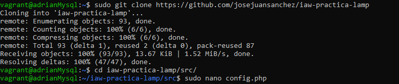
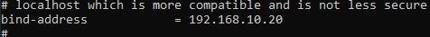

# Pila Lamp en dos niveles

## Creación de repositorio GitHub para el proyecto

Repositorio creado para subir el proyecto.

## Configuración de Vagrantfile

En el archivo Vagrantfile, crearemos 2 máquinas para crear nuestro Lamp a dos niveles. 
En dicho archivo, usaremos debian11 como SO de nuestros servidores, le asignaremos una IP privada para unirlas entre sí y una IP pública al servidor Web para tener acceso a Internet.

## Creación de aprovisionamiento

Para aligerar el proceso, crearemos un script para cada máquina de tal forma que ya tengamos todo listo para comenzar la 
configuración de cada una de ellas.
Script del servidor Mysql: 

Script del servidor Apache:

## Configuración de las máquinas

### Servidor Web

Dentro del servidor web, tendremos que crear un nuevo directorio dentro de "/var/www/" con el nombre que nosotros elijamos y cambiarle el dueño y grupo al que pertenecen.

Importaremos desde el repositorio Github dado en la práctica el directorio "sr", dentro del cual modificaremos la dirección IP de "@localhost" por la IP de nuestro servidor Web:

Por último, entraremos en "etc/apache2/", realizaremos una copia del archivo "000-default.conf", el cual deshabilitaremos, dentro del directorio "sites-available" y lo llamaremos Apache. En el, asignaremos la IP a nuestro servidor Web y habilitaremos como directorio web.

Para finalizar, reiniciaremos el servidor Web con el comando "sudo systemcls restart apache2"

### Servidor Mysql
En el servidor Mysql, importaremos desde el repositorio Github dado en la práctica, una base de datos y la configuraremos para nuestra red. 

En el archivo mysql.conf, cambiaremos la linea de "bind-address 172.0.0.1" por nuestra dirección IP del servidor Mysql.

Para finalizar los ajustes de nuestra base de datos, crearemos un usuario al cual le daremos permisos totales a la BD importada previamente.

Una vez hecho esto, reiniciamos nuestro servidor Mysql con el siguiente comando:

